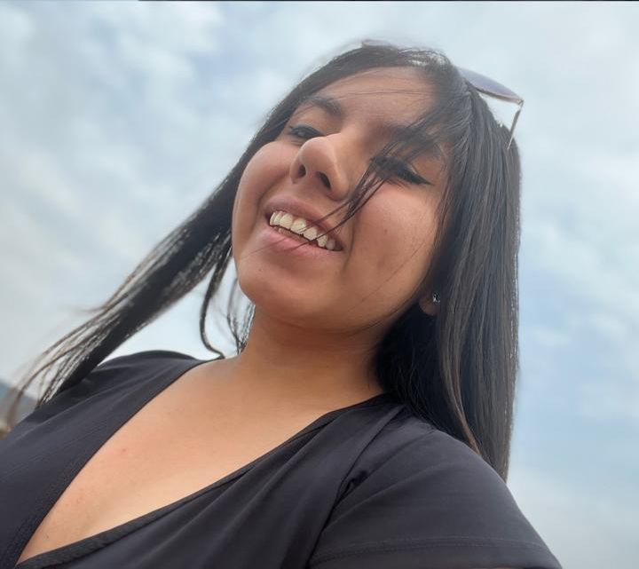

# PreBootcamp - Tracy Nicole Moriano Tuanama
<table align="center">
    <tr>
        <td align="center" style="width: 25%;">
            
        </td>
    </tr>
</table>

## Nivel
INTERMEDIO.

## Presentación
Hola, Soy Tracy Moriano.  
Apasionada por la tecnología y con muchas ganas de seguir aprendiendo y mejorando mis habilidades en desarrollo web.

## Proyecto
Este repositorio contiene una aplicación web sencilla que permite al usuario ingresar su nombre y recibir un saludo personalizado al hacer clic en un botón.

## Archivos
- `README.md`: Información descriptiva del proyecto y cómo ejecutarlo.
- `index.html`: Contiene la estructura principal del sitio web.
- `app.js`: Contiene la lógica en JavaScript para capturar el nombre y mostrar el saludo personalizado.
- `diseño.css`: Estilo visual del proyecto.
- `img`: Recursos gráficos (imágenes). 

## Preguntas del Formulario
- ¿QUÉ ROL TIENE EL PRODUCT OWNER?   
Es la persona que define y prioriza las funcionalidades que el equipo debe desarrollar para que el producto tenga el mayor valor posible.  

- ¿PARA QUÉ SIRVE EL DAILY SCRUM?  
Es una reunión diaria corta donde el equipo se coordina, comparte lo que hizo, lo que hará y los obstáculos que tiene para avanzar.  

- ¿QUÉ ES UN SPRINT?  
Es un período corto, en el que el equipo trabaja para completar un conjunto específico de tareas y entregar una parte funcional del producto.